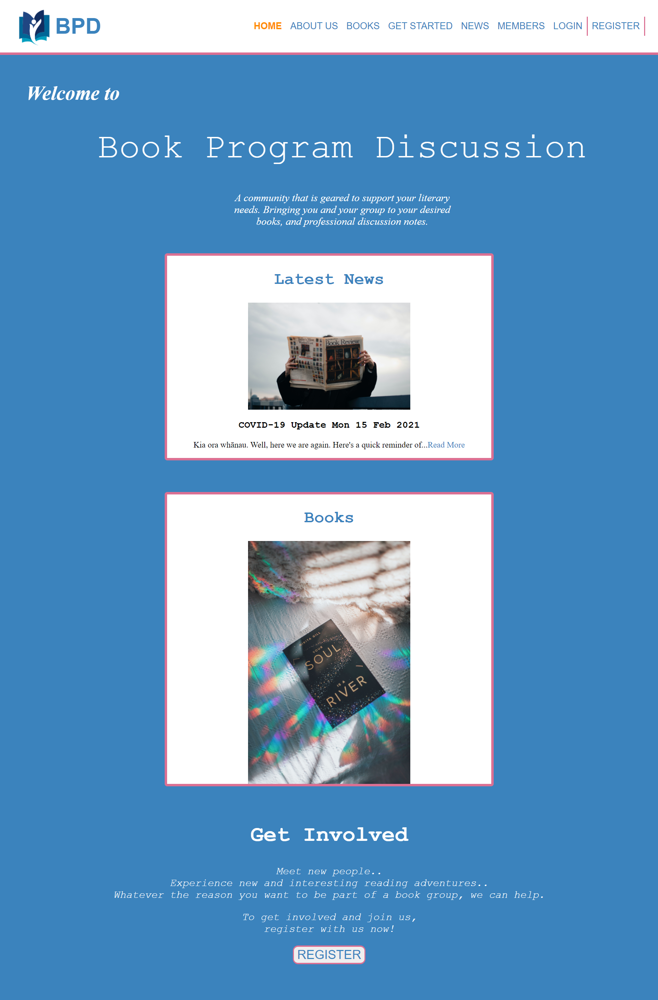
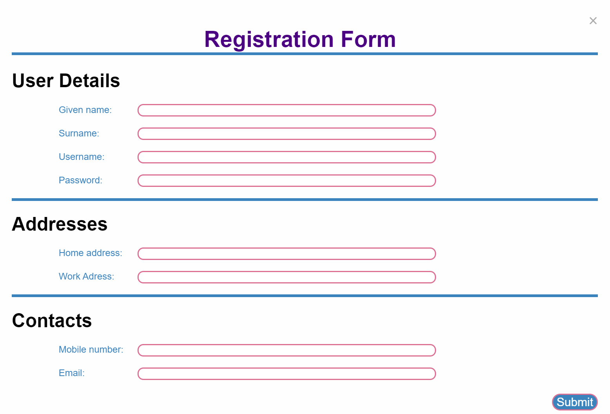

# High-fidelity_Prototype_Book-Discussion
A High-fidelity prototype made for a book discussion organisation "Book Program Discussion" using HTML, CSS, and JavaScript. Based off of a university assignment. As per the requirements only the homepage and registration modal form were meant to be shown.

## Screenshots

Homepage:

Form:

## References

### Modal form:

https://www.w3schools.com/howto/howto_css_modals.asp

### Two images were used:

1) Image from: https://www.pexels.com/photo/person-holding-white-and-brown-newspaper-3957616/

2) Image from: https://www.pexels.com/photo/your-soul-is-a-river-by-nikita-gill-book-904620/

